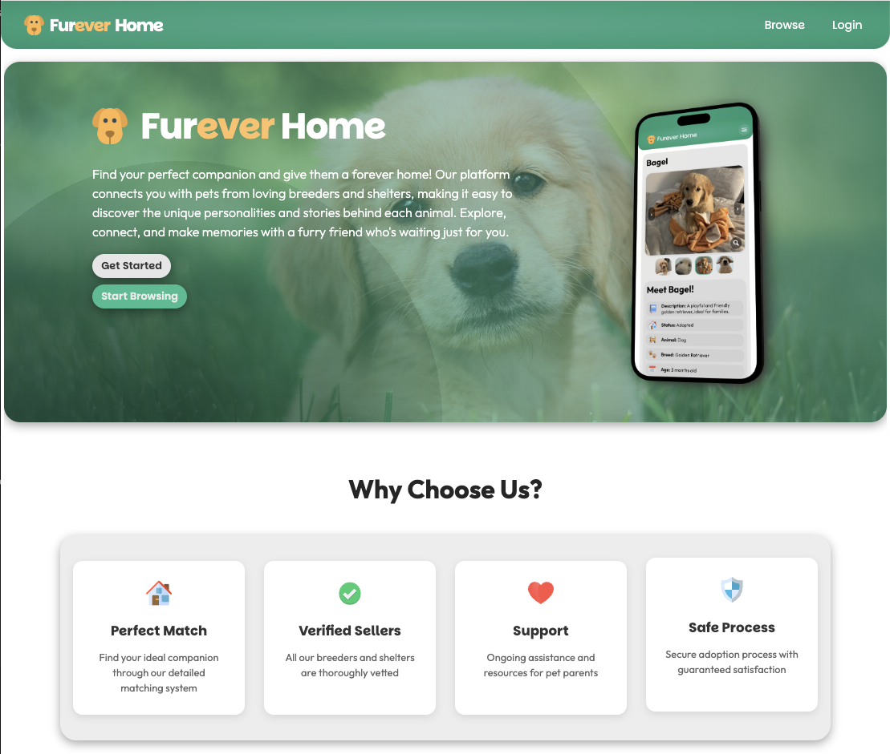
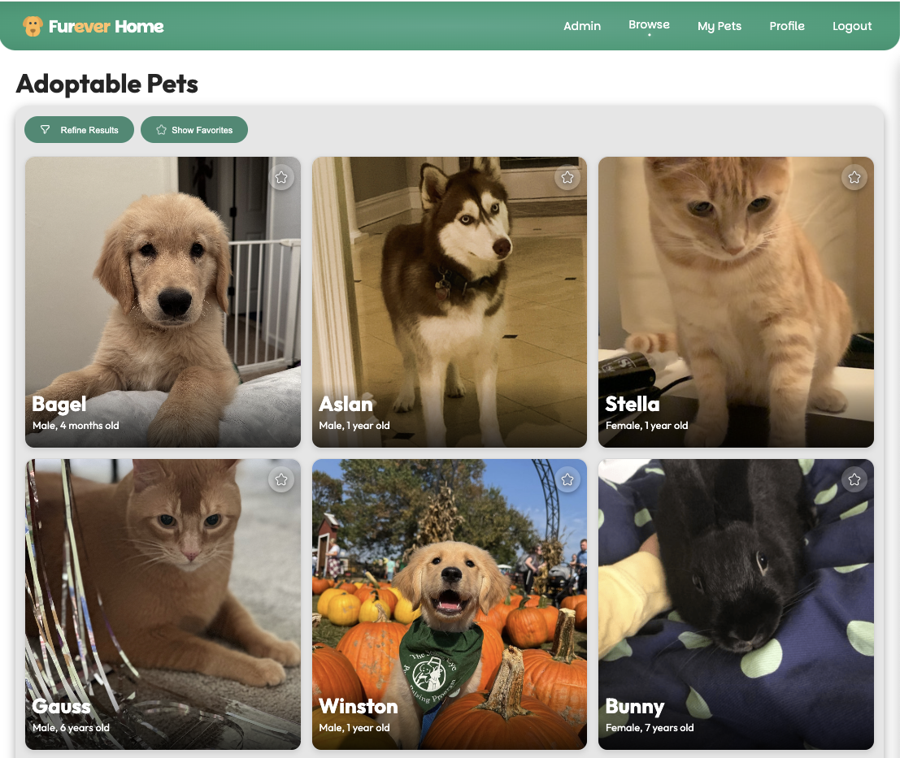
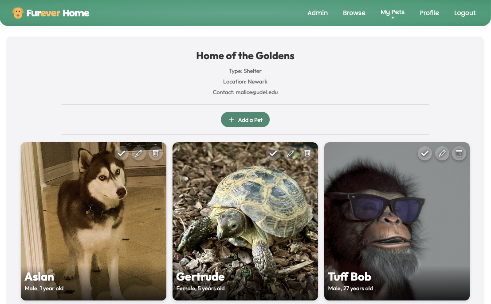
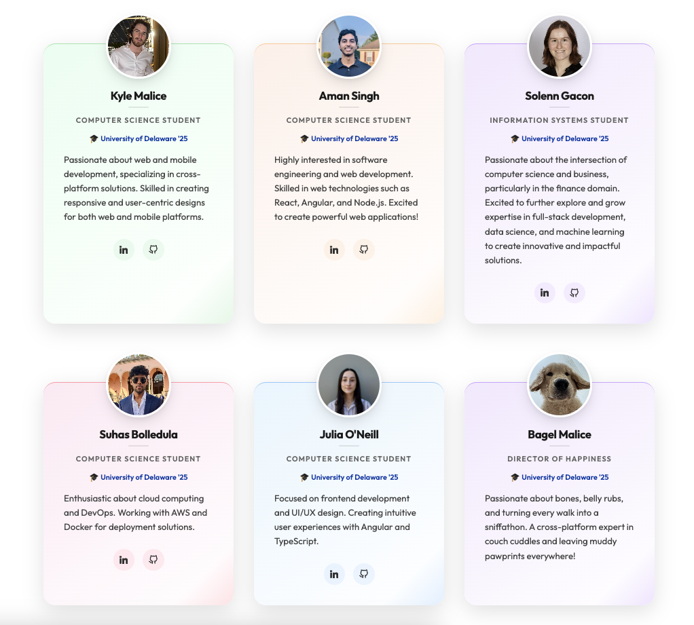

# Furever Home 🐾

Find your perfect companion and give them a forever home! Our platform connects you with pets from loving breeders and shelters, making it easy to discover the unique personalities and stories behind each animal. Explore, connect, and make memories with a furry friend who's waiting just for you.

## 📱 Application Preview

### Home Screen

### Browse Pets

### My Pets Dashboard

## ✨ Key Features

- **Perfect Match**: Find your ideal companion through our detailed matching system
- **Verified Sellers**: All our breeders and shelters are thoroughly vetted
- **Support**: Ongoing assistance and resources for pet parents
- **Safe Process**: Secure adoption process with guaranteed satisfaction

## 👥 Meet Our Team

### Development Team
- **Kyle Malice** - Computer Science '25
  - UI/UX Frontend Developer & Mobile and Web Development specialist
  - [LinkedIn](https://www.linkedin.com/in/kyle-malice/) | [GitHub](https://github.com/MaliceKy)

- **Aman Singh** - Computer Science '25
  - Software Engineering and Web Development Specialist
  - [LinkedIn](https://linkedin.com/in/amns) | [GitHub](https://github.com/amansjot)

- **Solenn Gacon** - Information Systems '25
  - Full-stack Development and Data Science
  - [LinkedIn](https://www.linkedin.com/in/solenngacon/) | [GitHub](https://github.com/solgaxx)

- **Suhas Bolledula** - Computer Science '25
  - Cloud Computing and DevOps Specialist
  - [LinkedIn](https://www.linkedin.com/in/suhas-bolledula/) | [GitHub](https://github.com/suhasbolledula)

- **Julia O'Neill** - Computer Science '25
  - Frontend Development and UI/UX Design
  - [LinkedIn](https://www.linkedin.com/in/juliaoneill15/)

- **Bagel Malice** - Director of Happiness '25
  - Expert in Team Morale!

## 🏫 Course Information
- **Course**: Project 3 - Angular UI
- **University**: University of Delaware
- **Group**: 8
